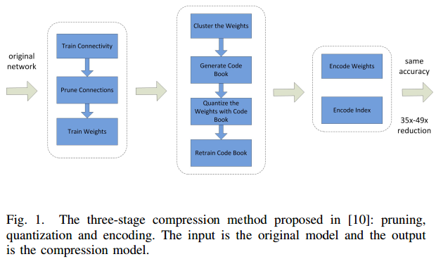
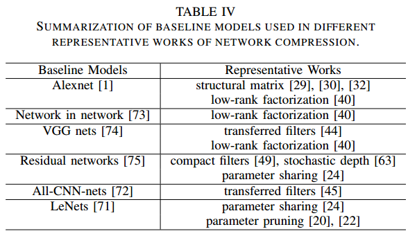

## 《A Survey of Model Compression and Acceleration for Deep Neural Networks》

Early works showed that network pruning is effective in reducing the network complexity and addressing the overfitting problem. The method proposed in [1] quantized the link weights using weight sharing and then applied Huffman coding to the quantized weights as well as the codebook to further reduce the rate.

1. S. Han, H. Mao, and W. J. Dally, “Deep compression: Compressing deep neural networks with pruning, trained quantization and huffman coding,” International Conference on Learning Representations (ICLR), 2016.

**Drawbacks:** the accuracy of the binary nets is significantly lowered when dealing with large CNNs such as GoogleNet. Another drawback of such binary nets is that **existing binarization schemes are based on simple matrix approximations and ignore the effect of binarization on the accuracy loss**. To address this issue, the work in [2] **proposed a proximal Newton algorithm with diagonal Hessian approximation that directly minimizes the loss with respect to the binary weights**. The work in [3] reduced the time on float point multiplication in the training stage by stochastically binarizing weights and converting multiplications in the hidden state computation to significant changes.

2. L. Hou, Q. Yao, and J. T. Kwok, “Loss-aware binarization of deep networks,” CoRR, vol. abs/1611.01600, 2016.
3. Z. Lin, M. Courbariaux, R. Memisevic, and Y. Bengio, “Neural networks with few multiplications,” CoRR, vol. abs/1510.03009, 2015.

The standard criteria to measure the quality of model compression and acceleration are the compression and the speedup rates. 主要用加速比和压缩比来衡量效果

Good compression methods are expected to achieve almost the same performance as the original model with much smaller parameters and less computational time. 

Thus compression and acceleration of the network should focus on different type of layers for different applications. CNN的参数主要在全连接层，大部分浮点运算主要在卷积操作（*有数据吗？*）
