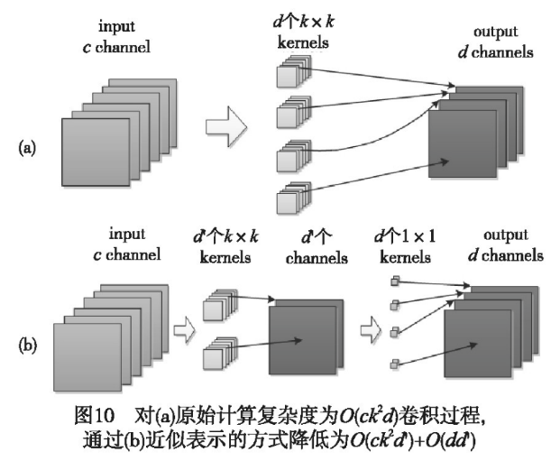
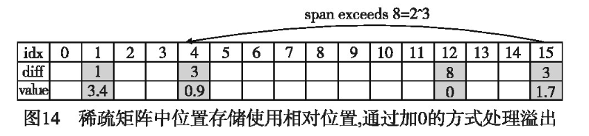

## 《神经网络模型压缩方法综述》 曹文龙 芮建武 李敏 来源：知网

Dropout的概念是1989年Le Cun等人提出的。主要应用在激活过程中, 通过随机选择的方式决定激活值是否传递到下一层。与Dropout不同的是Drop Connection, 是真正意义上的神经网络参数压缩模型, 该模型主要通过对权重矩阵中的小权重进行丢弃。实验[1,2]表明全连接仅仅通过Dropout的方式, 可以剔除90%左右的参数, 卷积层可以剔除60%的冗余参数。而且采用超参数设定Dropout率为50%时, 几乎没有准确率的损失, 甚至有稍许的准确率提升。此外, 由于Dropout方法易于实现, 效果明显, 在后来的神经网络设计中常常作为默认训练选项之一。

1. Han Song, Pool J, Tran J, et al. Learning both weights and connections for efficient neural networks[C]//Advances in Neural Information Processing Systems 28. 2015:1-9.
2. Ciresan D C, Meier U, Masci J, et al. High-performance neural networks for visual object classification[EB/OL]. (2011-02-01) . https://arxiv.org/abs/1102. 0183.

低秩分解基于不同卷积核特征之间存在冗余的事实, 利用分解后的卷积核的线性组合表示原始卷积核集合的特征的方法, 将高维度的卷积核卷积过程分解为低维向量的卷积过程。如图10所示原始计算复杂度为O (ckkd) 卷积过程, 近似表示的方式降低为O (ckkd') +O (dd') 。基于通过对神经网络模型中层与层之间交互是数据流的传输分析, Jaderberg等人[3]假设原始整个卷积核组可以被一部分卷积核 (这部分卷积核称为卷积核组的基) 线性表示。那么对于具有M个卷积核 (kernel) 的集合, 可以利用最小基向量线性表示近似所有kernel集合。

3. Jaderberg M, Vedaldi A, Zisserman A. Speeding up convolutionalneural networks with low rank expansions[EB/OL]. (2014-05-15) .https://arxiv.org/abs/1405. 3866.

神经网络模型的压缩过程中, 常常会遇到正确率损失的问题。例如, 随着神经网络层数的加深, 梯度消失和正确率退化问题凸显出来。尤其是正确率退化并不是因为过度拟合造成的[4]。

4. He Kaiming, Zhang Xiangyu, Ren Shaoqing, et al. deep residuallearning for image recognition[C] //Proc of IEEE Conference on Computer Vision and Pattern Recognition. Piscataway, NJ:IEEEPress, 2016:770-778.

神经网络参数的量化是网络压缩的一种方法, 有的学者甚至将神经网络采用+1、-1的二值进行表示权重 [5, 6] 。通过直接训练二值神经网络, 不仅能够节约存储空间, 而且将浮点计算转变为位运算上, 加上再采用SIMD技术 (single instruction, multiple data, 是一种计算机指令级别的优化技术) , 计算速度将提升32倍左右;但是, 随着二值化的表示而损失一部分计算准确度。因此用来减少精度损失的工作, 如HORQ [7] 将会备受关注。其主要解决思路就是精度损失后面补的方法, 通过将对残差的累加实现逼近原始模型的输出, 这种方法既实现了浮点计算转换为正数或者二值运算的加速, 又能保证了准确率。再结合不同平台的计算模式, 充分利用计算机架构特点, 实现不同平台的进一步加速。但是这种基于平台定制化的方案, 具有可迁移性差, 可移植性低, 人力成本高的特点。

为了减少进一步减小模型的存储空间, 往往采用不同的存储方式。存储稠密矩阵可以直接采用矩阵存储方式, 但是压缩后的神经网络模型往往具有稀疏性。因此采用针对稀疏性矩阵的存储方法, 可以更加有效地利用存储空间。例如, Han等人 [8] 为了进一步压缩模型, 对于权重的位置存储方式将绝对地址改为相对地址存储。这样位置存储的字节信息就可以被压缩。Han等人对于卷积层用8 bit来保存相对位置信息, 在全连接层中用5 bit;用3 bit保存相对位置为例子, 当相对位置超过8 (3 bit) 的时候, 需要在相对位置为8的地方填充一个0, 防止溢出。这种存储索引的方法只需要存储每个子空间内的位置信息和共享权重值的码表, 节省了大量存储空间。但由于计算过程相当于在进行稀疏矩阵的乘法, 需要消耗大量的存储访问时间, 如图14所示。

5. Courbariaux M, Hubara I, Soudry H, et al. Binarized neural net-works:training deep neural networks with weights and activationsconstrained to+1 or-1[EB/OL]. (2016-03-17) .[2017-04-10]. https://arxiv.org/abs/1602. 02830.
6. Rastegari M, Ordonez V, Redmon J, et al. Xnor-net:imagenet classification using binary convolutional neural networks[C]//Proc ofEuropean Conference on Computer Vision. Berlin:Springer, 2016:525-542.
7. Li Zefan, Ni Bingbing, Zhang Wenjun, et al. Performance guaranteed network acceleration via high-order residual quantization[C]//Proc of IEEE International Conference on Computer Vision. Piscata-way, NJ:IEEE Press, 2017:2603-2611.
8. Han Song, Mao Huizi, Dally W J. Deep compression:compressingdeep neural networks with pruning, trained quantization and Huffmancoding[EB/OL]. (2016-02-15) . https://arxiv. org/abs/1510.00149.
